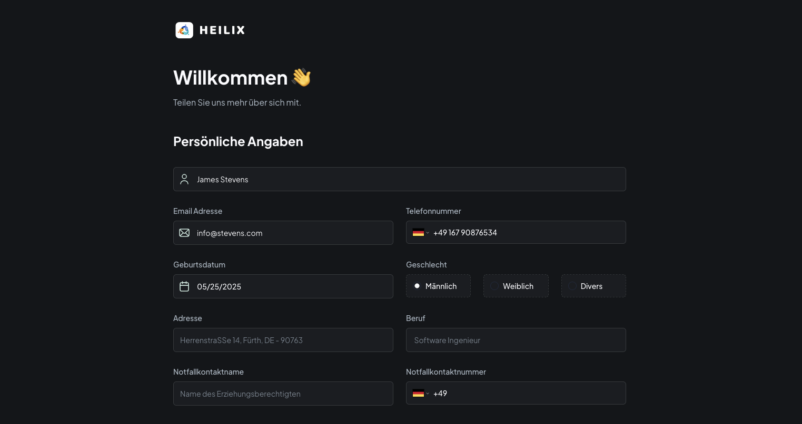
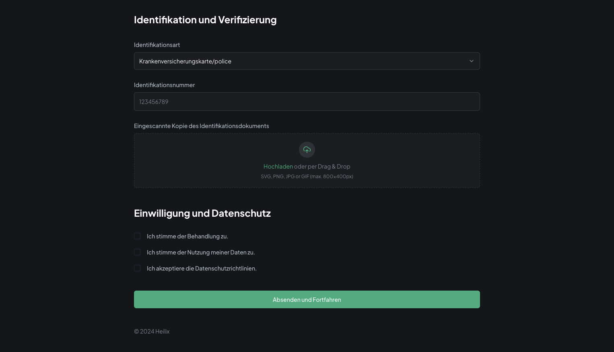
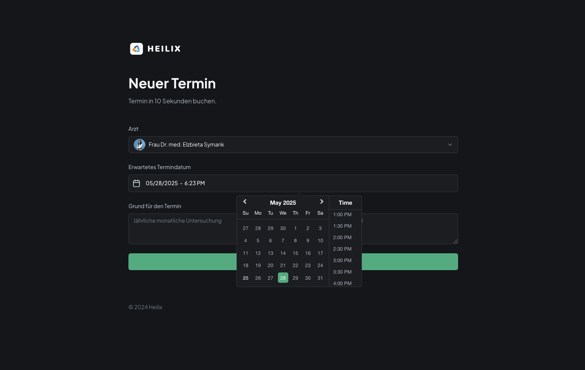

<div align="center">
  <h1>Patient Management System</h1>
  <p><strong>A modern, full-featured healthcare patient management system built for patients and administrators.</strong></p>

  [](https://nextjs.org/)
  [](https://appwrite.io/)
  [](https://www.typescriptlang.org/)
  [](https://tailwindcss.com/)
  [](https://ui.shadcn.dev/)
  [](https://www.twilio.com/)

</div>

--- 

### Patient Management System

A patient management application that allows patients to register, book, and manage appointments, while administrators can schedule, confirm, or cancel appointments. The system also features SMS notifications via Twilio, secure file storage using Appwrite, and performance monitoring with Sentry.

<br>








---

## 🔋 Features

- **Register as a Patient**  
  - Sign up and create a secure personal profile.

- **Book Appointments with Doctors**  
  - Patients can easily schedule appointments at their convenience.

- **Admin Dashboard for Appointment Management**  
  - View, manage, and organize all patient appointments efficiently.

- **Confirm / Schedule Appointments (Admin Side)**  
  - Admins can assign and confirm appointment times.

- **Cancel Appointments (Admin Side)**  
  - Appointments can be canceled or modified as needed by administrators.

- **SMS Notifications**  
  - Automated SMS confirmations sent via Twilio upon appointment approval.

- **File Upload Support**  
  - Securely upload and store patient files using Appwrite Storage.

- **Responsive UI**  
  - Fully responsive design optimized for mobile, tablet, and desktop devices.

- **Performance Monitoring**  
  - Integrated with **Sentry** to track performance metrics and log application errors.

---

## 🤸 Quick Start

### **Prerequisites**

Ensure you have the following installed on your machine:

- [Git](https://git-scm.com/)
- [Node.js](https://nodejs.org/en)
- [npm](https://www.npmjs.com/) (Node Package Manager)

### **Cloning the Repository**

```bash
git clone https://github.com/sjbentley/Patient-Management-System.git
cd Patient-Management-System
```

### **Installation**

Install the project dependencies using npm:

```bash
npm install
```

### **Set Up Environment Variables**

Create a new file named `.env.local` in the root of your project and add the following content:

```plaintext
# APPWRITE
NEXT_PUBLIC_ENDPOINT=https://cloud.appwrite.io/v1
PROJECT_ID=
API_KEY=
DATABASE_ID=
PATIENT_COLLECTION_ID=
APPOINTMENT_COLLECTION_ID=
NEXT_PUBLIC_BUCKET_ID=

NEXT_PUBLIC_ADMIN_PASSKEY=111111
```

Replace the placeholder values with your actual **Appwrite credentials**. You can obtain these credentials by signing up on the [Appwrite website](https://appwrite.io/).

### **Running the Project**

```bash
npm run dev
```

Open **[http://localhost:3000](http://localhost:3000)** in your browser to view the project.

---

## 🕸️ Snippets

Key snippets from the project will be added here.

## 🔗 Links

- [Project Demo](#) _(Coming Soon)_

## 🚀 More

For further questions or feature requests, open an issue in the repository. 🚀

## License

This project is licensed under the MIT License.

---

[Linktr.ee](https://linktr.ee/sirjahibentley) • [Tiktok](https://tiktok.com/@sirjahibentley) • [Instagram](https://instagram.com/sirjahibentley) • [Facebook](https://facebook.com/sirjahibentley)
